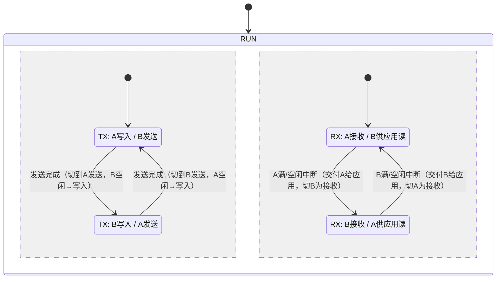

# 双缓冲区

双缓冲区主要用于通信外设，同一时间只会有一块缓冲区在进行收发，而另一块则进行拷贝或写入。双缓提供的预写/后读机制能够极大提高接口的吞吐能力，甚至能够逼近接口的理论最大带宽。

LibXR的双缓冲机制主要有两种：

1. 用于低速接口的驱动内置的双缓冲，主要存在于串口驱动。数据读写都需要通过fifo，会有两次拷贝
2. 用于高速接口的双缓冲，主要用于USB和SPI，用户可直接访问底层缓冲区，发送时无需拷贝

## 基本原理

以串口为例（实际接收可能会使用环形DMA，此处不讨论）

