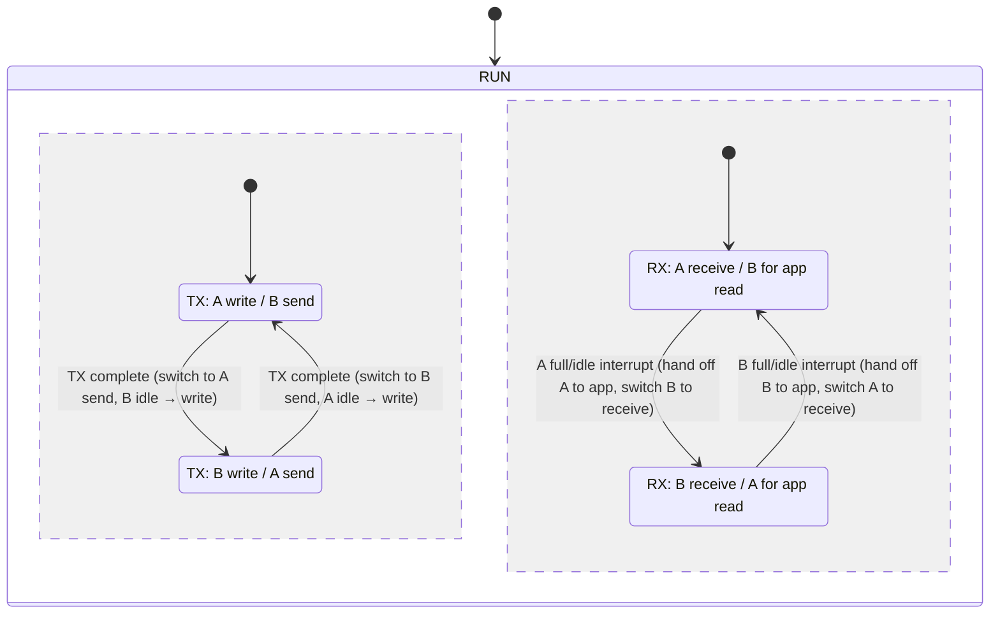

# Double Buffering

Double buffering is mainly used for communication peripherals. At any given time, only one buffer is transmitting or receiving, while the other is being copied or written. The pre-write/post-read mechanism provided by double buffering can greatly increase interface throughput, even approaching the interface’s theoretical maximum bandwidth.

LibXR provides two primary double-buffering mechanisms:

1. Driver-embedded double buffering for low-speed interfaces, used primarily in UART. Data reads and writes go through a FIFO, resulting in two copies.
2. Double buffering for high-speed interfaces, used mainly for USB and SPI. Users can access the underlying buffers directly, enabling zero-copy transmission.

## 基本原理

Take UART as an example (actual reception may use circular DMA; not discussed here):

